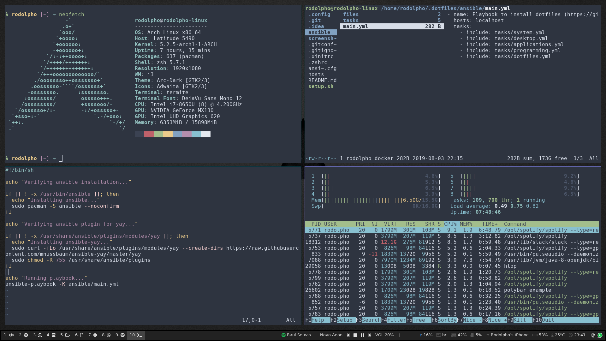

# .dotfiles

This is my Arch configuration running i3 as window manager



## Installation

Run this:

```sh
$ git clone https://github.com/rodolphocouto/dotfiles.git ~/.dotfiles
$ cd ~/.dotfiles
$ ./setup.sh
```